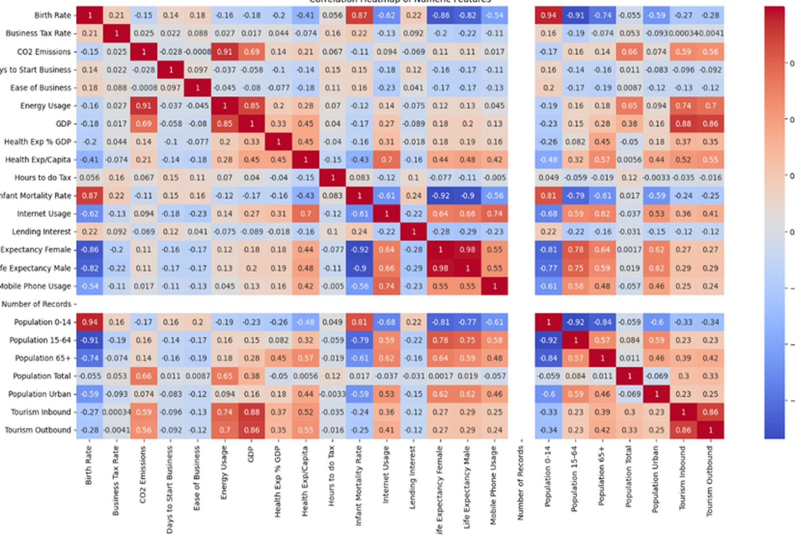

# 🌍 World Development Indicators Clustering

## 📌 Project Overview

This project analyzes global development data to group countries based on socio-economic indicators using clustering techniques.

## 🎯 Objective

To identify patterns among countries using indicators like GDP, population, health, and education.

## 🛠️ Tools & Technologies

* Python
* Pandas
* NumPy
* Matplotlib
* Seaborn
* Scikit-learn

## 📊 Methodology

* Data Cleaning
* Exploratory Data Analysis
* K-Means Clustering
* Elbow Method

## 📈 Key Insights

* Countries grouped based on development level
* High-income countries form one cluster
* Developing countries show similar trends
* Low-income countries grouped separately

## 📸 Results

### Clustering Output

### Correlation Heatmap

## 🚀 How to Run

1. Install dependencies
   pip install -r requirements.txt

2. Run the notebook

## 📁 Dataset

World Bank - World Development Indicators
