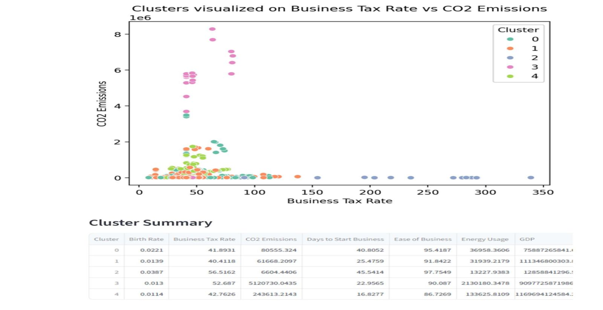

## 🌐 Live Demo
👉 [Click here to open the app](https://wdi-clustering.streamlit.app/)

# 🌍 World Development Indicators — Country Clustering

> An unsupervised machine learning project that groups countries by socio-economic development patterns using K-Means Clustering.

---

## 📌 Project Overview

This project uses **K-Means Clustering** to analyze and group countries based on key World Development Indicators (WDI) — including GDP, life expectancy, literacy rate, population growth, and infrastructure metrics. The goal is to uncover hidden patterns and development tiers across nations.

---

## 🎯 Objective

- Identify clusters of countries with similar development profiles
- Understand how economic, health, and demographic indicators relate
- Visualize global development patterns interactively

---

## 🛠️ Tools & Technologies

| Category | Tools |
|---|---|
| Language | Python 3.x |
| Data Handling | Pandas, NumPy, OpenPyXL |
| Visualization | Matplotlib, Seaborn |
| Machine Learning | Scikit-learn (KMeans, StandardScaler, PCA) |
| App Deployment | Streamlit |
| Notebook | Jupyter Notebook |

---

## 📁 Project Structure

    World-Development-Indicators-Clustering/
    │
    ├── wdi_clustering_analysis.ipynb   # Main analysis
    ├── Deployment_file.ipynb           # Streamlit deployment
    ├── wdi_dataset.xlsx                # Dataset
    ├── cluster_plot.png                # Cluster visualization
    ├── correlation_heatmap.png         # Heatmap
    ├── requirements.txt                # Dependencies
    └── README.md

---

## 📊 Methodology

1. **Data Collection** — World Bank World Development Indicators dataset
2. **Data Cleaning** — Handled missing values, removed low-variance columns
3. **EDA** — Correlation heatmap, distribution plots, feature analysis
4. **Feature Scaling** — StandardScaler for normalization
5. **Optimal K Selection** — Elbow Method + Silhouette Score
6. **K-Means Clustering** — Grouped countries into meaningful clusters
7. **Dimensionality Reduction** — PCA for 2D visualization
8. **Streamlit App** — Interactive dashboard for exploring clusters

---

## 📈 Key Results

- **Optimal Clusters:** 4 (based on Elbow Method and Silhouette Score)
- **Silhouette Score:** ~0.45 (indicates well-separated clusters)
- **Cluster Interpretation:**
  - 🔵 Cluster 0 — High-income, developed nations (high GDP, high life expectancy)
  - 🟠 Cluster 1 — Upper-middle income countries
  - 🟢 Cluster 2 — Lower-middle income, developing nations
  - 🔴 Cluster 3 — Low-income, least developed countries

---

## 📸 Visualizations

### Cluster Plot (PCA)

### Correlation Heatmap

---

## 🚀 How to Run

    # 1. Clone the repository
    git clone https://github.com/Navaneethadheeravath19/World-Development-Indicators-Clustering.git
    cd World-Development-Indicators-Clustering

    # 2. Install dependencies
    pip install -r requirements.txt

    # 3. Run the Jupyter Notebook
    jupyter notebook wdi_clustering_analysis.ipynb

---

## 📂 Dataset

- **Source:** [World Bank — World Development Indicators](https://databank.worldbank.org/source/world-development-indicators)
- **Format:** `.xlsx`
- **Coverage:** 190+ countries, multiple socio-economic indicators

---

## 👤 Author

**Navaneethadheeravath**
📧 Navaneethadheeravath19@gmail.com
🔗 [LinkedIn](http://www.linkedin.com/in/navaneetha19)
💻 [GitHub](https://github.com/Navaneethadheeravath19)

---

## ⭐ If you found this project useful, please give it a star!
